# Industry-Level Git Commands Practice

## Student Name
Benarji

---

# 1. Git Configuration Commands

## Command
git config --global user.name

### Syntax
git config --global user.name "Your Name"

### Purpose
Sets the global username used for commits.

### Example
git config --global user.name "Benarji"

### Screenshot
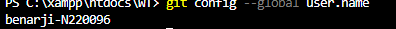

---

## Command
git config --global user.email

### Syntax
git config --global user.email "email@example.com"

### Purpose
Sets the global email used for commits.

### Example
git config --global user.email "benarji@gmail.com"

### Screenshot
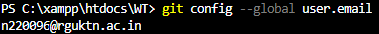

---

## Command
git config --list

### Syntax
git config --list

### Purpose
Displays all Git configuration settings.

### Example
git config --list

### Screenshot
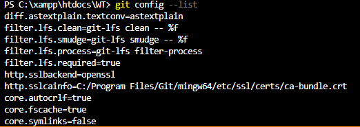

---

## Command
git config --unset

### Syntax
git config --global --unset user.name

### Purpose
Removes a configuration value.

### Example
git config --global --unset user.name

### Screenshot
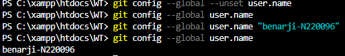

---

# 2. Repository Setup Commands

## Command
git init

### Syntax
git init

### Purpose
Initializes a new Git repository.

### Example
git init

### Screenshot
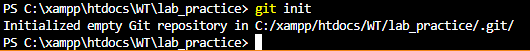

---

## Command
git clone

### Syntax
git clone <repository-url>

### Purpose
Copies a remote repository to the local machine.

### Example
git clone https://github.com/user/repo.git

### Screenshot
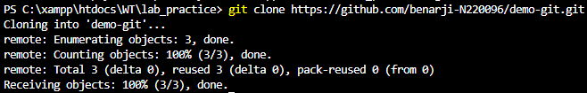

---

## Command
git clone --branch

### Syntax
git clone --branch branch-name <repo-url>

### Purpose
Clones a specific branch.

### Example
git clone --branch dev https://github.com/user/repo.git

### Screenshot
(Add screenshot here)

---

## Command
git clone --depth

### Syntax
git clone --depth 1 <repo-url>

### Purpose
Clones only the latest commit history.

### Example
git clone --depth 1 https://github.com/user/repo.git

### Screenshot
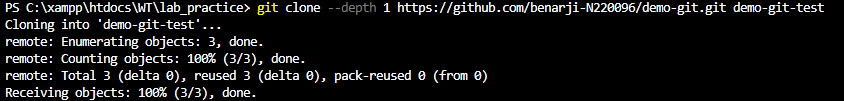

---

# 3. Repository Status & Inspection

## git status

### Purpose
Shows the working directory status.

### Example
git status
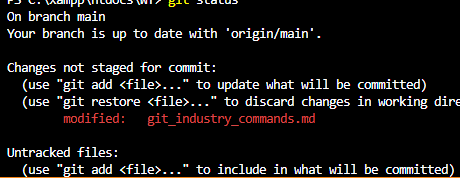
---

## git log

### Purpose
Displays commit history.

### Example
git log

---

## git log --oneline

### Purpose
Shows commits in a single-line format.

### Example
git log --oneline

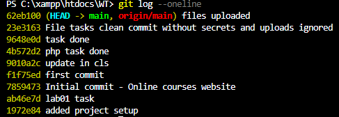
---

## git log --graph

### Purpose
Displays commit history with branch graph.

### Example
git log --graph

---

## git show

### Purpose
Shows details of a commit.

### Example
git show
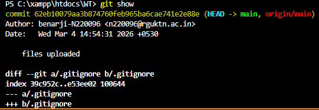
---

## git diff

### Purpose
Shows differences between commits.

### Example
git diff
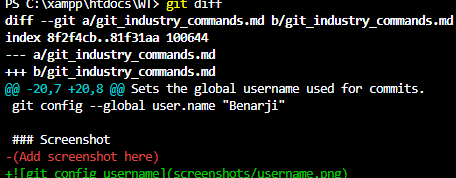
---

## git diff --staged

### Purpose
Shows staged changes.

### Example
git diff --staged

---

## git blame

### Purpose
Shows who modified each line in a file.

### Example
git blame file.txt
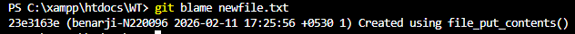
---

## git reflog

### Purpose
Shows reference logs of commits.

### Example
git reflog
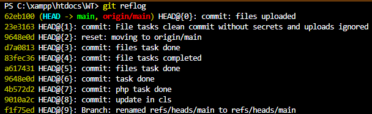
---

## git shortlog

### Purpose
Summarizes commit history.

### Example
git shortlog
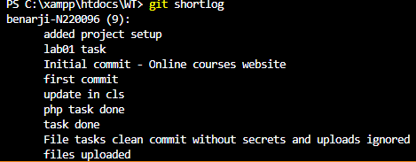
---

# 4. File Tracking Commands

## git add

### Purpose
Adds files to staging area.

### Example
git add file.txt

---

## git add .

### Purpose
Adds all files to staging.

### Example
git add .

---

## git add -p

### Purpose
Adds changes interactively.

### Example
git add -p

---

## git restore

### Purpose
Restores working directory files.

### Example
git restore file.txt
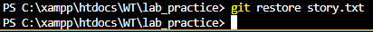
---

## git restore --staged

### Purpose
Unstages staged files.

### Example
git restore --staged file.txt
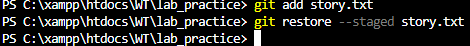
---

## git rm

### Purpose
Removes file from repo.

### Example
git rm file.txt
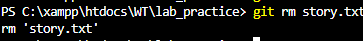
---

## git mv

### Purpose
Moves or renames a file.

### Example
git mv old.txt new.txt

---

# 5. Commit Commands

## git commit

### Purpose
Records staged changes.

### Example
git commit

---

## git commit -m

### Purpose
Commits with message.

### Example
git commit -m "Initial commit"

---

## git commit --amend

### Purpose
Modifies the last commit.

### Example
git commit --amend

---

## git commit --no-edit

### Purpose
Amends commit without changing message.

### Example
git commit --amend --no-edit

---

# 6. Branch Management

## git branch

### Purpose
Lists branches.

### Example
git branch

---

## git branch -a

### Purpose
Lists all branches.

### Example
git branch -a

---

## git branch -d

### Purpose
Deletes branch.

### Example
git branch -d feature

---

## git branch -D

### Purpose
Force deletes branch.

### Example
git branch -D feature

---

## git checkout

### Purpose
Switch branch.

### Example
git checkout dev

---

## git checkout -b

### Purpose
Creates and switches branch.

### Example
git checkout -b feature-ui

---

## git switch

### Purpose
Switch branch (modern command).

### Example
git switch dev

---

## git switch -c

### Purpose
Creates and switches branch.

### Example
git switch -c new-feature

---

# 7. Merge Commands

## git merge

### Purpose
Merges branches.

### Example
git merge feature-ui

---

## git merge --no-ff

### Purpose
Creates merge commit even if fast-forward possible.

### Example
git merge --no-ff feature-ui

---

# 8. Remote Repository Commands

---

## Command
git remote

### Purpose
Displays the list of remote repositories connected to the current Git repository.

### Example
git remote

### Screenshot
(Add screenshot here)

---

## Command
git remote -v

### Purpose
Shows the remote repository URLs for fetch and push operations.

### Example
git remote -v

### Screenshot
(Add screenshot here)

---

## Command
git remote add

### Purpose
Adds a new remote repository to the local repository.

### Example
git remote add origin https://github.com/username/repository.git

### Screenshot
(Add screenshot here)

---

## Command
git remote remove

### Purpose
Removes a remote repository connection from the local repository.

### Example
git remote remove origin

### Screenshot
(Add screenshot here)

---

## Command
git fetch

### Purpose
Downloads commits, files, and references from a remote repository without merging them.

### Example
git fetch

### Screenshot
(Add screenshot here)

---

## Command
git fetch --all

### Purpose
Fetches updates from all configured remote repositories.

### Example
git fetch --all

### Screenshot
(Add screenshot here)

---

## Command
git pull

### Purpose
Fetches changes from the remote repository and merges them into the current branch.

### Example
git pull origin main

### Screenshot
(Add screenshot here)

---

## Command
git pull --rebase

### Purpose
Fetches changes from the remote repository and rebases the current branch on top of them.

### Example
git pull --rebase origin main

### Screenshot
(Add screenshot here)

---

## Command
git push

### Purpose
Uploads local commits to the remote repository.

### Example
git push

### Screenshot
(Add screenshot here)

---

## Command
git push -u origin branch-name

### Purpose
Pushes a branch to the remote repository and sets it as the upstream branch for future pushes.

### Example
git push -u origin feature-ui

### Screenshot
(Add screenshot here)

---

## Command
git push --force

### Purpose
Forcefully pushes commits to the remote repository, overwriting remote history.

### Example
git push --force

### Screenshot
(Add screenshot here)

---

# 9. Stash Commands

---

## Command
git stash

### Purpose
Temporarily saves uncommitted changes so you can work on something else without committing them.

### Example
git stash

### Screenshot
(Add screenshot here)

---

## Command
git stash list

### Purpose
Displays the list of all saved stashes.

### Example
git stash list

### Screenshot
(Add screenshot here)

---

## Command
git stash pop

### Purpose
Applies the most recent stash and removes it from the stash list.

### Example
git stash pop

### Screenshot
(Add screenshot here)

---

## Command
git stash apply

### Purpose
Applies a stash without removing it from the stash list.

### Example
git stash apply

### Screenshot
(Add screenshot here)

---

## Command
git stash drop

### Purpose
Deletes a specific stash from the stash list.

### Example
git stash drop stash@{0}

### Screenshot
(Add screenshot here)

---

## Command
git stash clear

### Purpose
Removes all stashes from the stash list.

### Example
git stash clear

### Screenshot
(Add screenshot here)

---

# 10. Reset & Undo Commands

---

## Command
git reset

### Purpose
Resets the current HEAD to a specified state.

### Example
git reset

### Screenshot
(Add screenshot here)

---

## Command
git reset --soft

### Purpose
Moves HEAD to a previous commit but keeps changes staged.

### Example
git reset --soft HEAD~1

### Screenshot
(Add screenshot here)

---

## Command
git reset --mixed

### Purpose
Resets HEAD and unstages changes but keeps them in the working directory.

### Example
git reset --mixed HEAD~1

### Screenshot
(Add screenshot here)

---

## Command
git reset --hard

### Purpose
Resets HEAD and deletes all changes in the working directory.

### Example
git reset --hard HEAD~1

### Screenshot
(Add screenshot here)

---

## Command
git revert

### Purpose
Creates a new commit that reverses the changes of a previous commit.

### Example
git revert commit-id

### Screenshot
(Add screenshot here)

---

## Command
git clean -f

### Purpose
Removes untracked files from the working directory.

### Example
git clean -f

### Screenshot
(Add screenshot here)

---

## Command
git clean -fd

### Purpose
Removes untracked files and directories.

### Example
git clean -fd

### Screenshot
(Add screenshot here)

---

# 11. Rebasing Commands

---

## Command
git rebase

### Purpose
Reapplies commits from one branch onto another branch.

### Example
git rebase main

### Screenshot
(Add screenshot here)

---

## Command
git rebase -i

### Purpose
Starts an interactive rebase session for editing commit history.

### Example
git rebase -i HEAD~3

### Screenshot
(Add screenshot here)

---

## Command
git rebase --continue

### Purpose
Continues the rebase process after resolving conflicts.

### Example
git rebase --continue

### Screenshot
(Add screenshot here)

---

## Command
git rebase --abort

### Purpose
Cancels the rebase process and returns to the previous state.

### Example
git rebase --abort

### Screenshot
(Add screenshot here)

---

# 12. Cherry Pick & Patch Commands

---

## Command
git cherry-pick

### Purpose
Applies a specific commit from another branch to the current branch.

### Example
git cherry-pick commit-id

### Screenshot
(Add screenshot here)

---

## Command
git format-patch

### Purpose
Creates patch files from commits.

### Example
git format-patch -1

### Screenshot
(Add screenshot here)

---

## Command
git apply

### Purpose
Applies a patch file to the working directory.

### Example
git apply patchfile

### Screenshot
(Add screenshot here)

---

## Command
git am

### Purpose
Applies patches created by git format-patch.

### Example
git am patchfile

### Screenshot
(Add screenshot here)

---

# 13. Tagging Commands

---

## Command
git tag

### Purpose
Creates a tag to mark a specific commit.

### Example
git tag v1.0

### Screenshot
(Add screenshot here)

---

## Command
git tag -a

### Purpose
Creates an annotated tag with a message.

### Example
git tag -a v1.1 -m "version 1.1"

### Screenshot
(Add screenshot here)

---

## Command
git tag -d

### Purpose
Deletes a tag from the local repository.

### Example
git tag -d v1.0

### Screenshot
(Add screenshot here)

---

## Command
git push origin --tags

### Purpose
Pushes all tags to the remote repository.

### Example
git push origin --tags

### Screenshot
(Add screenshot here)

---

# 14. Submodule Commands

---

## Command
git submodule add

### Purpose
Adds another Git repository as a submodule inside the current repository.

### Example
git submodule add repo-url

### Screenshot
(Add screenshot here)

---

## Command
git submodule init

### Purpose
Initializes submodules in the repository.

### Example
git submodule init

### Screenshot
(Add screenshot here)

---

## Command
git submodule update

### Purpose
Updates and fetches submodule content.

### Example
git submodule update

### Screenshot
(Add screenshot here)

---

# 15. Debugging Commands

---

## Command
git bisect

### Purpose
Uses binary search to find the commit that introduced a bug.

### Example
git bisect

### Screenshot
(Add screenshot here)

---

## Command
git bisect start

### Purpose
Starts the bisect process.

### Example
git bisect start

### Screenshot
(Add screenshot here)

---

## Command
git bisect good

### Purpose
Marks a commit as a known good commit.

### Example
git bisect good

### Screenshot
(Add screenshot here)

---

## Command
git bisect bad

### Purpose
Marks a commit as a bad commit containing a bug.

### Example
git bisect bad

### Screenshot
(Add screenshot here)

---
# GitHub Features Demonstration

- Create repository
- Add README
- Add .gitignore
- Create issue
- Assign issue
- Create branch
- Push branch
- Create pull request
- Review pull request
- Merge pull request
- Resolve merge conflict
- Close issue
- Add labels
- Add collaborators

(Screenshots must be added for each feature)

---

# Final Commit

git add git_industry_commands.md

git commit -m "Added industry level Git commands practice"

git push